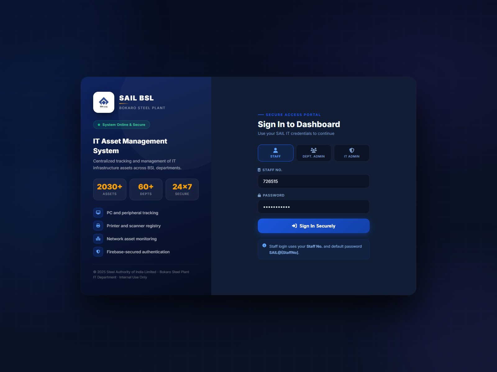
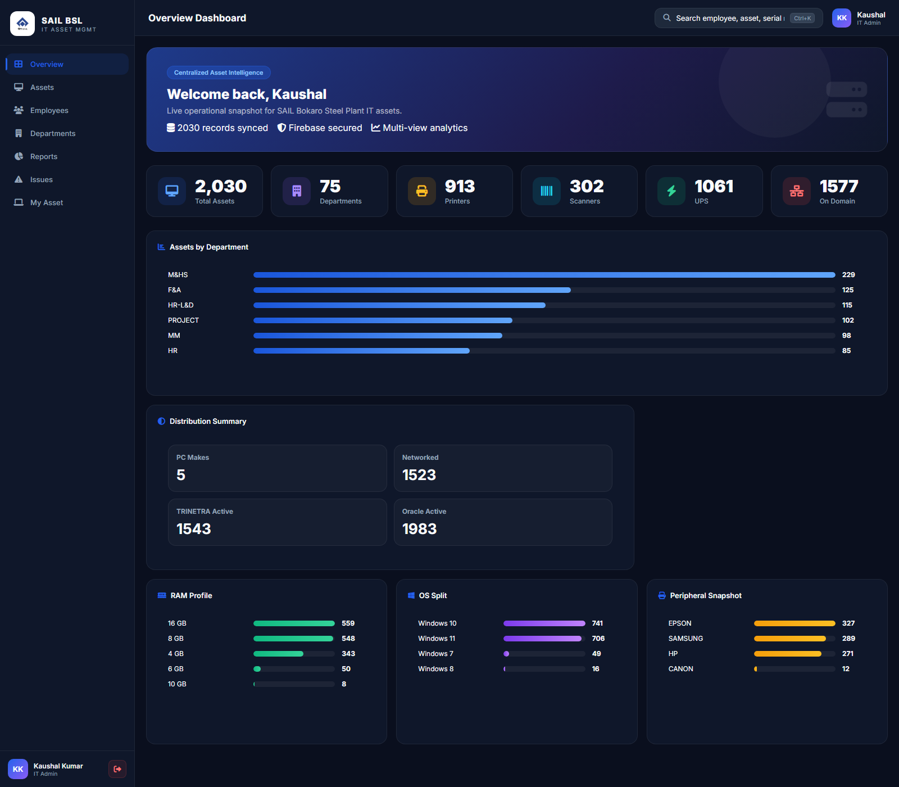
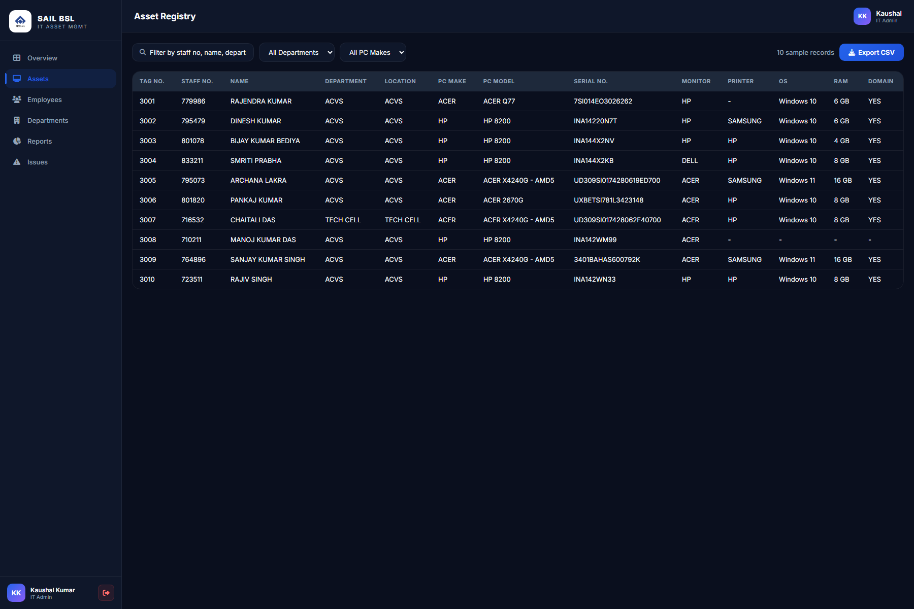
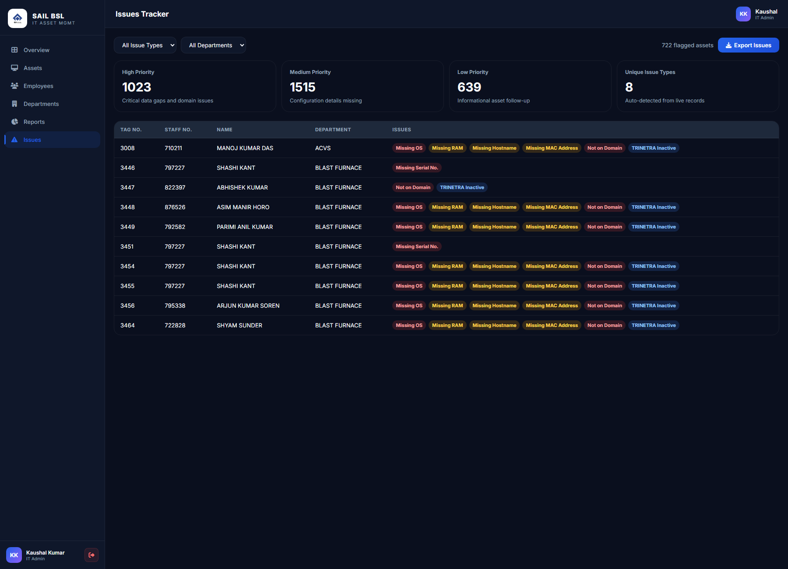

# SAIL BSL IT Asset Management System

Centralized IT asset tracking and reporting system for Bokaro Steel Plant, Steel Authority of India Limited.

## Overview

This project helps the IT team manage desktop systems, printers, scanners, UPS devices, and related infrastructure from a single dashboard. It includes role-based access, searchable asset records, department-wise reporting, issue detection, and Firebase-backed authentication and storage.

## Screenshots

| Login | Overview |
| --- | --- |
|  |  |

| Asset Registry | Issues Tracker |
| --- | --- |
|  |  |

## Core Features

- Role-based access for staff, department admins, and IT admins
- Centralized asset registry for 2000+ records
- Search, filtering, pagination, and CSV export
- Dashboard KPIs and visual summaries for departments, devices, RAM, OS, and peripherals
- Department-wise inventory views and reporting
- Issues tracker for missing or inconsistent asset information
- Personalized "My Asset" view for staff users
- Firebase Authentication and Firestore integration
- Responsive UI built for desktop and tablet workflows

## Modules

### Login Portal

- Secure sign-in flow with role selection
- Staff number based authentication flow
- Firebase-backed session handling

### Dashboard Overview

- Top-level KPI cards
- Department and asset distribution summaries
- Quick operational snapshot for IT admins

### Asset Registry

- Search across asset fields
- Department and device filters
- Tabular view of tagged hardware and system details
- CSV export for filtered records

### Issues Tracker

- Detects missing serial number, OS, RAM, MAC address, hostname, monitor, domain status, and TRINETRA status
- Severity-based grouping for faster follow-up
- Export support for issue lists

### Reports and Department Views

- Department-wise summaries
- Peripheral and domain status snapshots
- Operational reporting for IT review

## Tech Stack

- HTML5
- CSS3
- Vanilla JavaScript
- Chart.js
- Firebase Authentication
- Cloud Firestore

## Project Structure

```text
sail-bsl-it-assets/
|-- index.html
|-- dashboard.html
|-- dashboard.css
|-- dashboard.js
|-- login.js
|-- firebase.js
|-- data.js
|-- migrate.html
|-- create-users.html
`-- screenshots/
```

## Getting Started

### 1. Clone the repository

```bash
git clone https://github.com/Kaushalkumar012/sail-bsl-it-assets.git
cd sail-bsl-it-assets
```

### 2. Configure Firebase

Update `firebase.js` with your Firebase project settings if you are deploying this to a different Firebase project.

### 3. Run locally

Because the project uses ES modules, serve it through a local server instead of opening files directly:

```bash
npx serve . -p 3000
```

Then open `http://localhost:3000`.

### 4. Migrate records

Open `migrate.html` in the browser and use the migration flow to push asset data into Firestore.

### 5. Create users

If you are using the admin tooling:

```bash
cd admin-script
npm install
node create-users.js
```

## Security Notes

- Keep Firebase credentials and admin service account files out of version control
- Restrict Firestore rules and admin operations to authorized users only
- Treat employee and infrastructure data as internal information

## Author

Kaushal Kumar  
